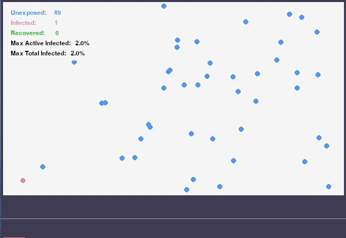
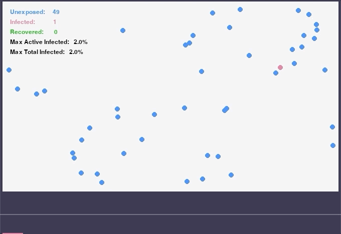
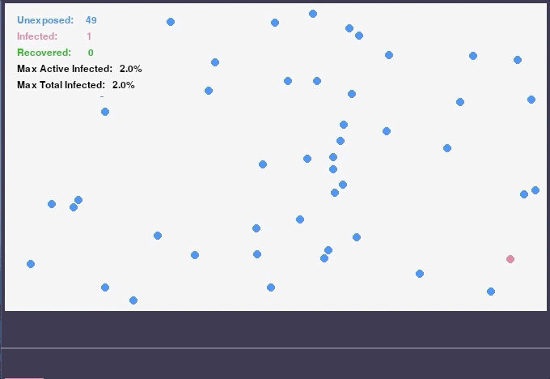
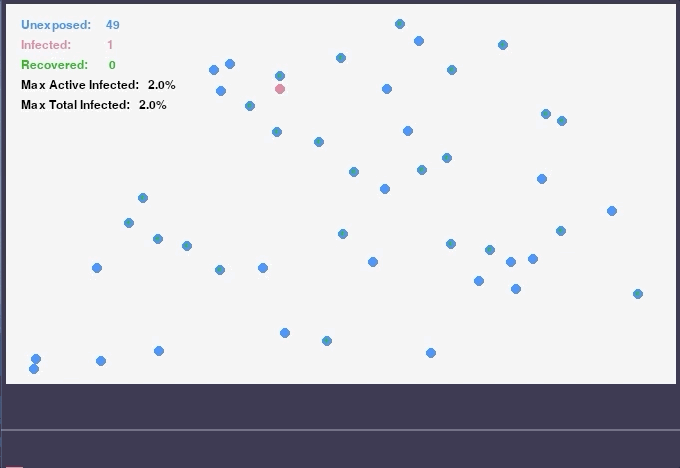

This is a crude simulation of an edpidemic using Python and `pygame`.

The simulation consists of a 2-dimensional space in which a configurable number of epidemiological hosts move and transmit a contagious state with variable linear velocity.

Each host exists in a state of unexposed, infected, or recovered.

  
  
  
  
